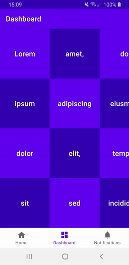

# recycler-swipes

Simple library to make it easily implement swiping gestures on a recycler view by using xml.

## Demo

## Usage

    val swipes = RecyclerSwipes(
        SwipeDirection.LEFT to R.layout.swipe_left_block,
        SwipeDirection.RIGHT to R.layout.swipe_right_delete
    )

    swipes.attachTo(recyclerView)
    swipes.setOnSwipeListener { vH: RecyclerView.ViewHolder, dir: SwipeDirection ->
        ...
    }
